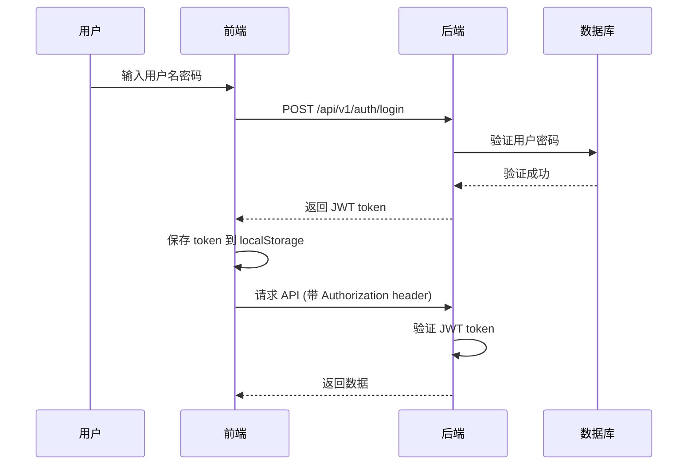
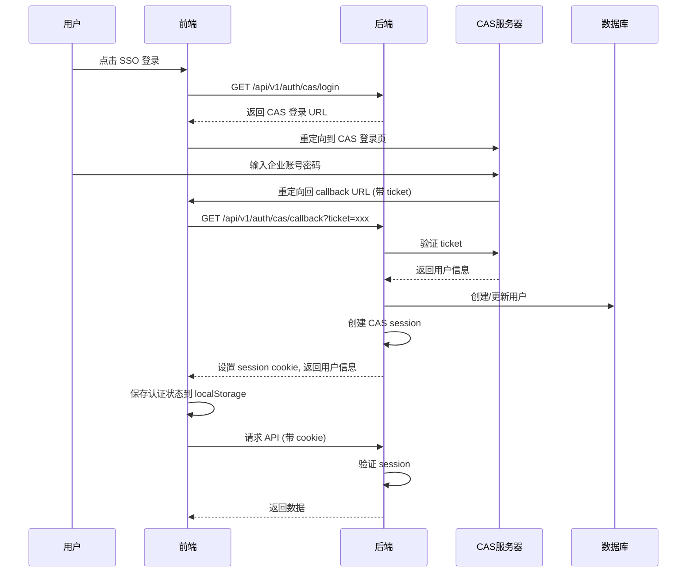

# OMind 认证架构设计

## 概述

OMind 平台支持双认证系统，完全隔离的两种认证方式：
1. **JWT Token 认证**：本地用户名密码登录
2. **CAS Session 认证**：企业单点登录（SSO）

## 认证流程

### 1. JWT Token 认证流程



### 2. CAS Session 认证流程



## 前端状态管理

### useAuth Hook 状态结构

```typescript
interface AuthState {
  user: User | null;
  token: string | null;          // 仅 JWT 认证使用
  isAuthenticated: boolean;
  loading: boolean;
  authType: 'jwt' | 'cas' | null;
}
```

### localStorage 存储策略

| 认证类型 | 存储内容 |
|---------|---------|
| JWT | `token`, `refresh_token`, `user`, `auth_type` |
| CAS | `isAuthenticated`, `user`, `auth_type` |

### 认证状态判断逻辑

```typescript
// JWT 认证状态
isAuthenticated = !!localStorage.getItem('token')

// CAS 认证状态  
isAuthenticated = localStorage.getItem('isAuthenticated') === 'true'

// 综合判断
isAuthenticated = !!token || localStorage.getItem('isAuthenticated') === 'true'
```

## 后端认证依赖

### get_current_user_optional

支持两种认证方式的统一入口：

```python
async def get_current_user_optional(request: Request, db: AsyncSession):
    # 1. 尝试 CAS Session 认证
    cas_session_id = request.cookies.get("cas_session_id")
    if cas_session_id:
        # 验证 session 有效性
        # 返回用户信息
    
    # 2. 尝试 JWT Token 认证
    authorization = request.headers.get("Authorization")
    if authorization and authorization.startswith("Bearer "):
        # 验证 token 有效性
        # 返回用户信息
    
    return None  # 无认证信息
```

## 路由保护策略

### 前端路由保护

```typescript
// ProtectedRoute 组件
if (!isAuthenticated) {
  return <Navigate to="/login" />
}
```

### 后端 API 保护

```python
# 需要认证的 API
@router.get("/protected")
async def protected_api(
    current_user: User = Depends(get_current_user)
):
    # current_user 不为 None
    
# 可选认证的 API
@router.get("/public")
async def public_api(
    current_user: Optional[User] = Depends(get_current_user_optional)
):
    # current_user 可能为 None
```

## 登出处理

### JWT 登出
1. 清除前端 localStorage 中的 token
2. 清除 Zustand store 中的状态
3. 跳转到登录页

### CAS 登出
1. 清除前端 localStorage 中的认证状态
2. 清除 Zustand store 中的状态
3. 调用后端 CAS logout API
4. 重定向到 CAS 登出页面
5. CAS 登出完成后重定向回登录页

## 错误处理

### 认证失败场景

1. **JWT Token 过期**
   - 自动尝试使用 refresh_token 刷新
   - 刷新失败则清除认证状态，跳转登录页

2. **CAS Session 过期**
   - 后端返回 401
   - 前端保持本地状态但提示需要重新登录
   - 用户再次点击 SSO 登录

3. **无权限访问**
   - 用户已认证但无菜单权限
   - 跳转到 /no-permission 页面
   - 提示联系管理员

### 首次登录处理

1. **JWT 用户**
   - 直接登录，使用已分配的角色和权限

2. **CAS 用户**
   - 首次登录自动创建用户
   - 分配默认角色"普通用户"
   - 如无可访问菜单，跳转无权限页面

## 最佳实践

1. **认证类型隔离**
   - JWT 和 CAS 认证完全独立
   - 不混用 token 和 session
   - 各自维护独立的状态

2. **状态同步**
   - 使用 updateAuthState 统一更新状态
   - 避免直接使用 setState
   - 确保 localStorage 和 Zustand 状态一致

3. **路由跳转**
   - 登录成功后获取用户首个可访问页面
   - 避免硬编码跳转路径
   - 处理无权限场景

4. **错误处理**
   - 区分网络错误和认证错误
   - 提供友好的错误提示
   - 自动处理 token 刷新

## 配置要求

### 环境变量

```bash
# CAS 配置
CAS_SERVER_URL=https://cas.example.com
CAS_SERVICE_URL=http://localhost:3000/sso/callback

# JWT 配置
JWT_SECRET_KEY=your-secret-key
JWT_ALGORITHM=HS256
ACCESS_TOKEN_EXPIRE_MINUTES=30
REFRESH_TOKEN_EXPIRE_DAYS=7
```

### 前端代理配置

```typescript
// vite.config.ts
proxy: {
  '/api': {
    target: 'http://localhost:8000',
    changeOrigin: true,
  }
}
```

### Cookie 配置

```python
# CAS session cookie
response.set_cookie(
    key="cas_session_id",
    value=session_id,
    max_age=86400,  # 24小时
    httponly=True,
    samesite="lax",
    secure=False  # 生产环境应设为 True
)
```

## 故障排查

### 常见问题

1. **"第一次登录不生效"**
   - 原因：状态更新异步，路由跳转过早
   - 解决：使用 updateAuthState 统一更新，延迟跳转

2. **"登录成功但停留在登录页"**
   - 原因：默认路由 "/" 重定向到需要权限的页面
   - 解决：动态获取用户首个可访问页面

3. **"Cookie 未发送"**
   - 原因：fetch 配置缺少 credentials
   - 解决：设置 credentials: 'include'

4. **"CAS 用户无法访问任何页面"**
   - 原因：默认角色无菜单权限
   - 解决：管理员分配菜单权限给"普通用户"角色